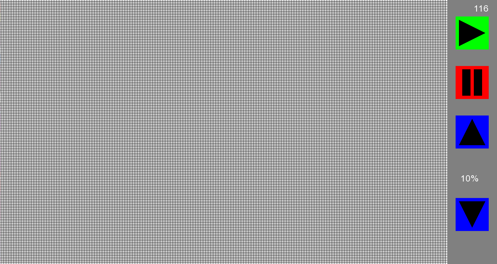

# Game Of Life

# Wiki
Gra w życie jest przykładem aparatu komórkowego. Została ona wymyślona przez Johna Hortona Conwaya, brytyjskiego matematyka, w 1970 roku.
Odbywa się ona na kwadratowej siatce komórek, gdzie każda komórka może być albo żywa, albo martwa. Ich zachowaniem kierują następujące reguły:
* Komórka ożywa, gdy ma dokładnie trzech sąsiadów żywych.
* Komórka przeżywa, gdy ma dwóch lub trzech sąsiadów żywych (umiera, gdy ma ich mniej niż dwoje — z samotności, lub gdy ma ich więcej niż czworo — z przeludnienia).

# Interfejs i sterowanie
Prawy górny róg przedstawia liczbę klatek na sekundę (FPS).  
Następne przyciski po kolei to:
* Start symulacja
* Stop symulacja
* Zwiększ prędkość symulacji
* Zmniejsz prędkość symulacji  
Prędkość symulacji wyrażona jest w procentach (min10% - max 100%). 

Poruszać się po mapie można za pomocom strzałek a nowe komórki ustawiamy za pomocom lewego przycisku myszy.
